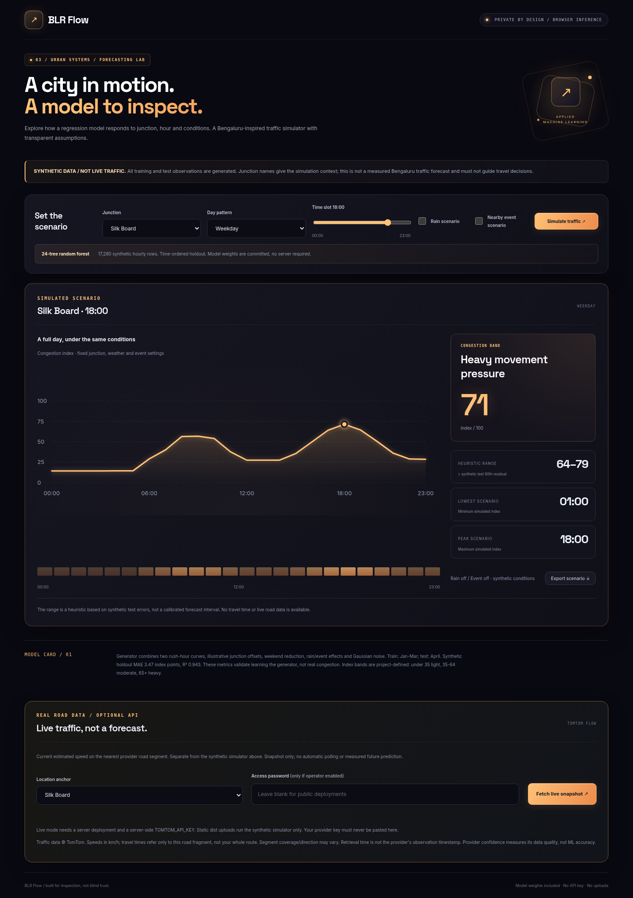
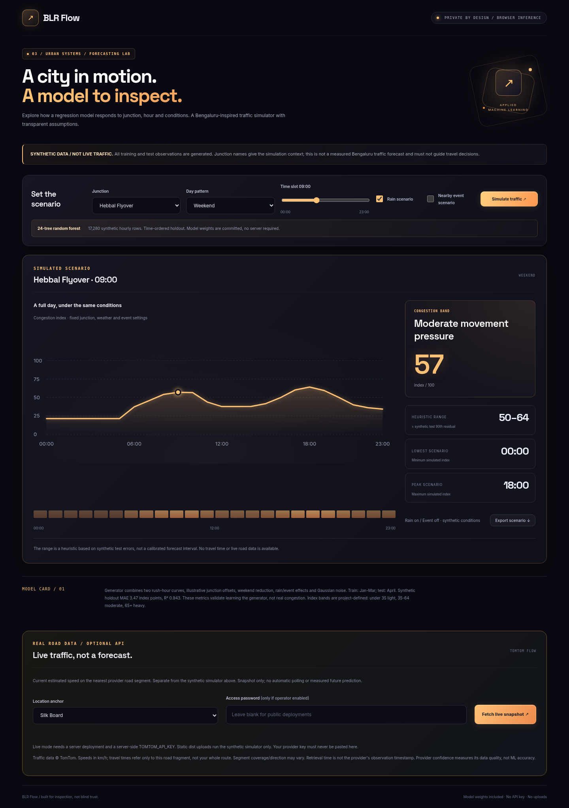

# BLR Flow

A Bengaluru-inspired regression simulator with hourly charts and scenario comparisons.

**A working ML/data-science portfolio project, not a production decision system.**

## What it does

Explore weekday/weekend, rain and event scenarios; inspect a full-day curve, an intensity strip and a downloadable JSON report.

## Model and evidence

- **Method:** 24-tree random forest regressor (max depth 8), with cyclical hour encodings, junction index and scenario flags.
- **Training data:** 17,280 synthetic hourly observations over 120 days at six named junctions. Illustrative offsets and rush-hour curves are assumptions, not observations.
- **Evaluation:** Time-ordered split: 12,960 Jan-Mar train rows / 4,320 April test rows. MAE 3.47 index points; R² 0.943 on synthetic data only.
- **Pipeline:** Scenario → junction + sine/cosine hour + weekend/rain/event → exported tree traversal → mean regression output → hourly SVG line chart.

## Portfolio talking points

Explain the feature pipeline, data provenance, holdout design, cross-language model export, and why the output is limited. Do not present synthetic metrics as real-world validation or claim clinical/ATS accuracy.

## Limitations and next steps

Use licensed measured traffic data, add rolling-origin validation and exogenous forecasts, and validate calibrated prediction intervals. Not usable as live route guidance.

Read [`models/MODEL_CARD.md`](models/MODEL_CARD.md) before interpreting outputs.

## Run locally

Node **22.23.3 or newer** is required. `.nvmrc` pins the tested version.

```bash
npm ci
npm test
npm run dev
```

Open the local URL printed by Vite. No Python, API keys, accounts or training are needed to use the app.

## Deploy in under a minute (prebuilt)

1. Extract the project ZIP.
2. Sign in at [Netlify](https://app.netlify.com/login), then open [Netlify Drop](https://app.netlify.com/drop).
3. Drag the **`dist` folder inside this project** into the drop area. Drop `dist`, not `src` or `models`.
4. Open the `netlify.app` URL Netlify returns. The included `dist` is already production-built and tested.
5. After source edits, run `npm ci && npm run build`, then deploy the new `dist`.

Reference: [Netlify manual deployment docs](https://docs.netlify.com/manage/projects/add-new-project/).

### GitHub-connected Netlify deployment

Create a fresh GitHub repository and upload **the contents of this project folder** (README and package.json must sit at repository root). Do not upload the ZIP as your only file. Keep `node_modules` out of GitHub. In Netlify, import that repository, use build command `npm run build`, publish directory `dist`, and `NODE_VERSION=22.23.3`. `netlify.toml` already supplies these values.

No Render server or Streamlit service is needed. The Python model was trained ahead of time; the JavaScript app evaluates the exact exported model locally.

## Reproduce the model (optional)

Tested training environment: **Python 3.10**, NumPy 2.2.6, scikit-learn 1.7.2.

```bash
python3 -m venv .venv
# macOS/Linux:
source .venv/bin/activate
# Windows PowerShell instead: .venv\Scripts\Activate.ps1
pip install -r training/requirements.txt
python training/train.py
npm test
npm run build
```

Training overwrites `models/model.json` and cross-language test fixtures. Fixed seed 42 makes the experiment reproducible within the pinned environment. Models are JSON, not pickle, so deployment does not execute deserialized Python objects.

## Architecture

```
training/train.py  -> data + trained sklearn model -> models/model.json
models/model.json -> browser inference in src/ml.mjs -> src/main.js UI
                     tests/model.test.mjs checks sklearn parity
```

- `src/main.js`: input validation, rendering and interactions.
- `src/ml.mjs`: pure inference/math functions; only the relevant functions are bundled.
- `src/ui.mjs` / `src/style.css`: responsive interface and inline SVG charts.
- `models/`: frozen model artifacts and model card.
- `data/`: documented training data/corpus.
- `tests/`: Node unit tests and sklearn-generated golden outputs.
- `dist/`: prebuilt static deployment, included deliberately.
- `screenshots/`: desktop start/result screens and mobile result view.
- `.github/workflows/ci.yml`: build + test on push/PR.

## Screenshots

Actual UI screenshots, not mockups:




Mobile screenshot: [mobile.png](screenshots/mobile.png).
After deploying, you can replace these with your own screenshots. Live demo URL: **add your Netlify URL here**.

## Verification

- `npm test`: numerical parity with Python/scikit-learn golden fixtures at 1e-10 tolerance, plus project-specific edge cases.
- `npm run build`: production bundle.
- Manual/automated Chromium checks: desktop 1440px, phone 390px, form validation, sample-to-result flows, JSON download and no uncaught browser errors.
- Outputs are computed from committed model weights; no fabricated API responses or random UI scores.

## Privacy and security

No analytics, remote model APIs, file uploads, cookies or local-storage persistence. Text/values are processed in browser memory and clear on refresh. Netlify still receives ordinary page requests; hosting access logs are separate from model inputs. Use exports carefully, especially health inputs. Dynamic text inserted into markup is escaped. Source and model weights are intentionally public when you publish the repository.

## Stack and design

Python + scikit-learn for model fitting; framework-free JavaScript ES modules, Vite 8 and CSS for inference/UI. No third-party browser runtime dependencies or remote fonts. This keeps deployment small, avoids sending private inputs to a server, and makes inference inspectable. Near-black grid backgrounds, accent glows, bold Space Grotesk headings, Inter body text, gradient actions and responsive result panels make the interface cinematic. Both font files are bundled locally with their OFL licenses; no remote font requests. Motion respects prefers-reduced-motion.

## License

Application code: MIT. Third-party datasets keep their original terms; see `data/README.md`. Do not claim model validation outside the stated dataset or population.

## Optional REAL live traffic

New separate live panel uses TomTom road-segment observations through a Netlify Function. It never labels current traffic as future ML prediction. Server-only key, manual requests, optional access password, no synthetic live substitution. Setup, current 20,000/month free API allowance, limitations and sources are in [LIVE_SETUP.md](LIVE_SETUP.md). **Live requires Git-connected full-source deploy and TOMTOM_API_KEY; dist-only Drop remains synthetic-only.** No actual key/production endpoint was tested; fixture tests do not prove provider access.
